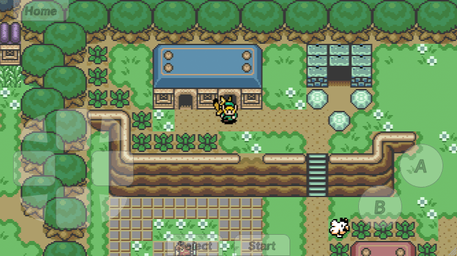

2dk
===

> A from-scratch JavaScript 2D game development SDK & engine.


[](https://app.netlify.com/sites/2dk/deploys)


## Getting started
This source code is using the [Clutch SDK](), another repository I manage. To get started with the 2dk source, clone this repo and then:

```shell
# Bootstrap the Clutch environment
npm run bootstrap

# Run the dev server and watch scripts
npm start
```


## Studio software
The studio software is an [Electron]() application. Currently there are no package scripts for the software distribution as the project is still in what I would consider pre-beta development. For source execution:

```shell
# Install the software dependencies
cd studio && npm i

# Runs the Electron application
npm run start:studio
```

I've been using the game [Link's Awakening](https://www.zeldadungeon.net/wiki/The_Legend_of_Zelda:_Link%27s_Awakening) as a model for the game engine and mechanics of the `TopView` plugin for the `Player`. If you run the Studio you'll find it's there, aptly named [Link's Re-awakening](https://2dk.kitajchuk.com/games/la/?buster=260). It's important to note I take no credit for the IPs used for testing nor for the artwork and designs. All I've done is painstakingly increased the resolution of sprites and tilesets I've compiled from the internet.

Some screenshots of the software in action. Right now you can create and paint maps quite well. It's basically Photoshop for 2D map painting. A 2dk game is a static webapp that contains all it's own resources and JSON files. The Player, or engine, has a mobile first philosophy behind it and is designed to be played as a standalone webapp on your phone. I spent a fair amount of time making the touch controls, specifically the 8-point dpad, work very well.

#### Mobile Player:


#### Fullscreen mode:



#### Painting maps


## Open source
I've been mostly good about documenting where I've found resources online. Things like spritesheets, tilesets and sound files.

#### Assets
* Sounds for Link's Awakening DX from [khinsider](https://downloads.khinsider.com/game-soundtracks/album/link-s-awakening-dx)
* Sprites and Tiles from [The Sprites Resource](https://www.spriters-resource.com/game_boy_gbc/thelegendofzeldalinksawakeningdx)

#### Inspiration
* I'm an OG fan of [kesiev's](https://github.com/kesiev) [Akihabara](https://www.kesiev.com/akihabara) work
* [Gotta Code Them All](https://www.slideshare.net/Berttimmermans/gotta-code-them-all-a-pokmon-and-html5-lovestory) got me thinking back in the day as well
