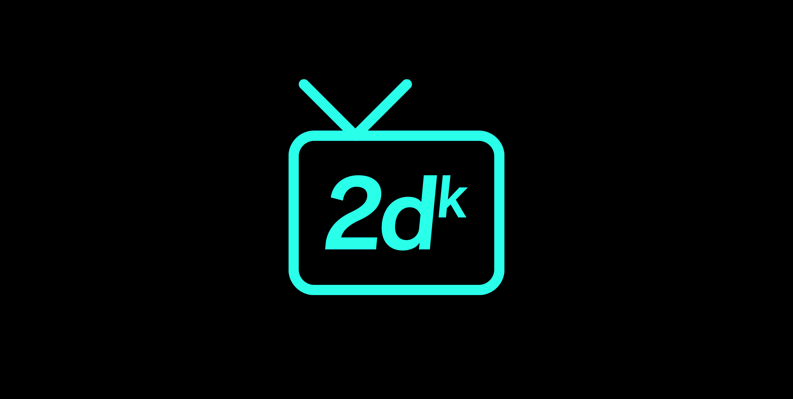

2dk
===

> For the love of 2D. A JavaScript SDK.


[](https://app.netlify.com/sites/2dk/deploys)





## Getting started
To develop clone this repo and then:

```shell
# Install packages
yarn

# Build all resources
yarn build

# Run local dev server for static frontend
yarn dev
```


## Studio software
The studio software is an [Electron](https://www.electronjs.org/) application. Currently there are no package scripts for the software distribution as the project is still in what I would consider alpha development. To run the electron application for local development:

```shell
# From project root build all resources
yarn build

# Move to studio software directory
cd studio

# Install packages
yarn

# Run the electron app
yarn dev
```

#### Map painting
Currently you can create and paint maps quite well for the background, foreground and collision layers. It's basically Photoshop for 2D map painting. I've been using the game [Link's Awakening](https://www.zeldadungeon.net/wiki/The_Legend_of_Zelda:_Link%27s_Awakening) as a model for the game engine and mechanics of the `TopView` plugin for the `Player`. If you run the Studio you'll find it's there, named [LA](https://2dk.kitajchuk.com/games/la/).

#### Audio compression
As of right now the ability for uploaded audio files (mp3) to be compressed requires the installation of [lame](https://lame.sourceforge.io/). For macos you can simply `brew install lame`. The electron software then uses [node-lame](https://www.npmjs.com/package/node-lame) for the compression (only if `lame` is available). Ideally the software will bundle the lame executable for each distro when we get there.

#### Game bundles
A 2dk game is a static [PWA](https://developer.mozilla.org/en-US/docs/Web/Progressive_web_apps) that contains all its own resources and data files. The Player, or engine, has a mobile first philosophy behind it and is designed to be played as a standalone web app on your phone. It handles offline mode with a [Service Worker](https://developer.mozilla.org/en-US/docs/Web/API/Service_Worker_API/Using_Service_Workers) that caches all the game resources.

#### Resources
I've found the [Mozilla Gaming](https://developer.mozilla.org/en-US/docs/Games) docs to be quite helpful. I used these to implement the [Gamepad](https://developer.mozilla.org/en-US/docs/Web/API/Gamepad_API) API so I can play with my USB NES controller when developing in electron.


## Open source
I've been trying to keep track of where I've found resources online. Stuff like sprites, tiles and audio.

#### Assets
* Sounds for Link's Awakening DX from [khinsider](https://downloads.khinsider.com/game-soundtracks/album/link-s-awakening-dx)
* Sprites and Tiles from [The Sprites Resource](https://www.spriters-resource.com/game_boy_gbc/thelegendofzeldalinksawakeningdx)

#### Inspiration
* I'm an OG fan of [kesiev's](https://github.com/kesiev) original [Akihabara](https://www.kesiev.com/akihabara) work
* [Gotta Code Them All](https://www.slideshare.net/Berttimmermans/gotta-code-them-all-a-pokmon-and-html5-lovestory) got me thinking back in the day as well


## Disclaimer
**It's important to note I take no credit for the Nintendo IPs used for testing nor for the artwork and designs. All I've done is increased the resolution of sprites and tilesets I've compiled from the internet.**
