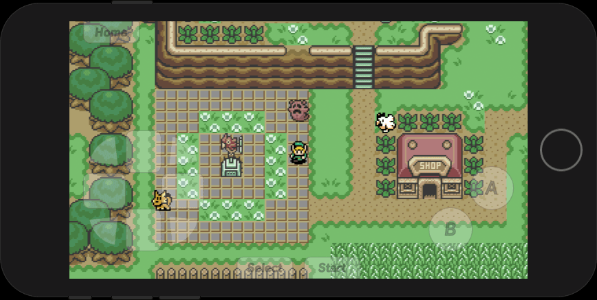

2dk
===

> Nostalgia for 2D gaming wrapped up in a JavaScript SDK.


[](https://app.netlify.com/sites/2dk/deploys)


## Development roadmap

* Code docs (framework?)
* Code unit tests (framework?)

#### Studio Software
* Game configure starting data hero (spawn, map, sounds, companion, sprite)
* Map Active Tiles (group, layer, coords, offsetX, offsetY, dur, stepsX, action, attack)
* Map Spawnpoints (x, y, dir)
* Map Ojbects, Sprites & NPCs (id, ai, spawn, payload)
* Map CellAuto registration UI
* Map Events (coords, type, map, dir, spawn?)
* Map FX Maker
* Map NPC Maker
* Map Hero Maker (companion?)
* Quest status system
* Refactor dialogue(s) system for quest status
* Resolution rendering
* External storage
* Engine upgrades
* Software upgrades
* Distribution
* Software player (...debugger)
* Map collider should be dynamic (precision: 4)
* Uploads with progress, bulk uploads?
* History states for painting (undo/redo)

#### Game Engine
* HUD (health, item, status)
* Menus (inventory, worldmap, save, etc...)
* Quest (items, key items, weapons, story, cutscenes)
* Save State (local storage, persistence?)
* Audio (mobile has issues...)
* GameCycle manager for states (intro, title, credits, cutscenes etc...)
* Render foreground textures to background if BEHIND Hero?
* Hero weapon animations / collisions (sword...?)
* Tile interactions (fall, etc...)
* Hero sprite masking?
* Grass sprite cycle / sound
* Water sprite cycle / sound
* Sword sprite cycle / sound / collision
* Push / Pull
* Swimming
* Falling
* Attacking & Weapons
* Charged Hero + Release Attack
* Move resistance (pushing, tiles, etc...)
* Object interaction hints (A Open, A Check, etc...)

#### NPC AIs
* Butterflies / Bugs
* Perception box (aggro-ranges)
* Projectiles (with FX)
* Enemies (Baddies)

#### Multiplayer (MMO)
* Multiplayer online
    * Websocket player streaming (broadcast)
    * Websocket server deploys (Clutch AWS)
    * Lambda (Port Netlify functions to AWS Lambda)
    * JWT token in-memory client storage (fully private?)
* Versioned game package tar balls (releases)
    * Requires a difference between saves / releases
    * Implement "Package Release" button to create tar ball


## Getting started
This source code is using the [Clutch SDK](https://github.com/kitajchuk/clutch). To develop clone this repo and then:

```shell
# Clutch install
npm i

# PM2 server / Webpack watcher
npm start
```


## Studio software
The studio software is an [Electron](https://www.electronjs.org/) application. Currently there are no package scripts for the software distribution as the project is still in what I would consider pre-beta development. For source execution:

```shell
# Install the software dependencies
npm i studio

# Runs the Electron application
npm run studio

# Webpack watcher
npm run watch
```

**It's important to note I take no credit for the Nintendo IPs used for testing nor for the artwork and designs. All I've done is increased the resolution of sprites and tilesets I've compiled from the internet.**

Currently you can create and paint maps quite well for the background, foreground and collision layers. It's basically Photoshop for 2D map painting.

I've been using the game [Link's Awakening](https://www.zeldadungeon.net/wiki/The_Legend_of_Zelda:_Link%27s_Awakening) as a model for the game engine and mechanics of the `TopView` plugin for the `Player`. If you run the Studio you'll find it's there, named [LA](https://2dk.kitajchuk.com/games/la/?buster=260).

A 2dk game is a static webapp that contains all it's own resources and JSON files. The Player, or engine, has a mobile first philosophy behind it and is designed to be played as a standalone webapp on your phone. I spent a fair amount of time making the touch controls, specifically the 8-point dpad, work very well.

I've found the [Mozilla Gaming](https://developer.mozilla.org/en-US/docs/Games) docs to be quite helpful. I used these to implement the [Gamepad](https://developer.mozilla.org/en-US/docs/Web/API/Gamepad_API) API so I can play with my USB NES controller when developing in Firefox. There are some other debug mode features available when running a 2dk game in a desktop browser.

#### Mobile Player:


#### Fullscreen mode:


#### Painting maps


## Open source
I've been trying to keep track of where I've found resources online. Stuff like sprites, tiles and audio.

#### Assets
* Sounds for Link's Awakening DX from [khinsider](https://downloads.khinsider.com/game-soundtracks/album/link-s-awakening-dx)
* Sprites and Tiles from [The Sprites Resource](https://www.spriters-resource.com/game_boy_gbc/thelegendofzeldalinksawakeningdx)

#### Inspiration
* I'm an OG fan of [kesiev's](https://github.com/kesiev) original [Akihabara](https://www.kesiev.com/akihabara) work
* [Gotta Code Them All](https://www.slideshare.net/Berttimmermans/gotta-code-them-all-a-pokmon-and-html5-lovestory) got me thinking back in the day as well
